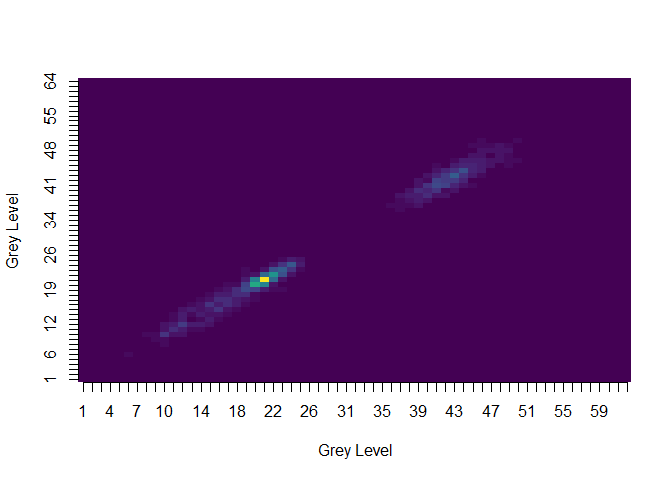

Radiomics: Texture Analysis Matrices
====================================

The `radiomics` package is a set of tools for computing texture matrices and features from images.

You can install the development version of the package using:

``` r
devtools::install_github("joelcarlson/radiomics")

library(radiomics)
```

Texture Matrices
================

In the package are functions for calculating four different types of matrices used to quantify the texture of an image.

These matrices are the:

-   Gray Level Co-occurrence Matrix
-   Gray Level Run Length Matrix
-   Gray Level Size Zone Matrix
-   Multiple Gray Level Size Zone Matrix

Detailed descriptions and references for each matrix can be found [here](http://joelcarlson.me/2015/07/10/radiomics-package/) Detailed usage directions for calculating features and matrices can be found in the package vignette (use `browseVignettes(package = "radiomics")`)

Using the Package
=================

Building Texture Matrices
-------------------------

Texture matrices can be created from 2D images by using the abbreviated matrix name as a function call:

``` r
tumor <- radiomics::tumor #2D MRI slice of a brain tumor
glcm(tumor)
glrlm(tumor)
glszm(tumor)
mglszm(tumor)
```

A matrix with the class of the texture matrix type is return, as shown here using `glcm(tumor, n_grey=4)`

    #> An object of class "glcm"
    #>              1          2           3            4
    #> 1 0.1617021277 0.03356974 0.001891253 0.0004728132
    #> 2 0.0335697400 0.38345154 0.010638298 0.0014184397
    #> 3 0.0018912530 0.01063830 0.301654846 0.0184397163
    #> 4 0.0004728132 0.00141844 0.018439716 0.0203309693

``` r
class(glcm(tumor, n_grey=4))[1]
#> [1] "glcm"
```

Visualizing Texture Matrices
----------------------------

Each matrix type has an associated `image` function for visualization of the results:

``` r
image(glcm(tumor))
image(glrlm(tumor))
image(glszm(tumor))
image(mglszm(tumor))
```

The `image` functions make use of the `viridis` scale, as shown here using `image(glcm(tumor, n_grey=64))`:



Calculating Features
--------------------

Each matrix type has an associated `calc_features` function, which returns an object of class `data.frame` with a single observation for each calculated feature.

``` r
calc_features(glcm(tumor))
calc_features(glrlm(tumor))
calc_features(glszm(tumor))
calc_features(mglszm(tumor))
```
